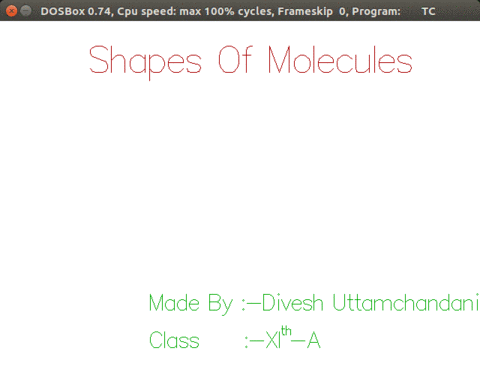

# VSEPR-Models
Author: Divesh Uttamchandani    
Contact: [Email](mailto:diveshuttamchandani@gmail.com)  
Profiles: 
[BITS-Pilani](http://www.bits-pilani.ac.in/spp/f2016045) | [GitHub](https://github.com/diveshuttam) | [LinkedIn](https://www.linkedin.com/in/diveshuttam/) 

This is my class XI project.
This project is a basic GUI in C++ which predicts shapes of common inorganic compounds using VSEPR theory and also draws representative basic structures pertaining to that compound on the screen. 
This project predicts shape correctly for most of the compounds composed of s and p block elements such as H2O Xe2O2F2 PCl5 etc. which fall in the domain of VSEPR theory. It also tries to predict hybridization of the compound using VBT
The source code compiles with **Turbo C++**, so for those who run windows newer than xp can use [DosBox](http://www.dosbox.com/) to run TC and build this project.  
The working and design of this project is similar to [AED](https://github.com/diveshuttam/AED). This is infact the project which inspired GUI of [AED](https://github.com/diveshuttam/AED) so for details about compilation and working of this project you could refer to the documentation of the above project which resides in the [report folder](https://github.com/diveshuttam/AED/tree/master/REPORT). The seperate documentation of this project is going to be released soon.  
<h3 align="center">
Demo Run for XeO2F2  
</h3>

  

  
  

### Watch the extended demo video on YouTube:  
[Shapes Of Molecules | Class XI CS Project](https://youtu.be/QjlbObuqWrU)
